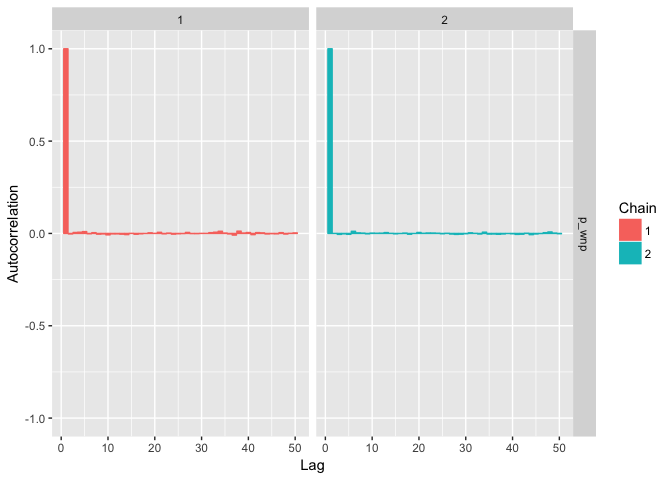
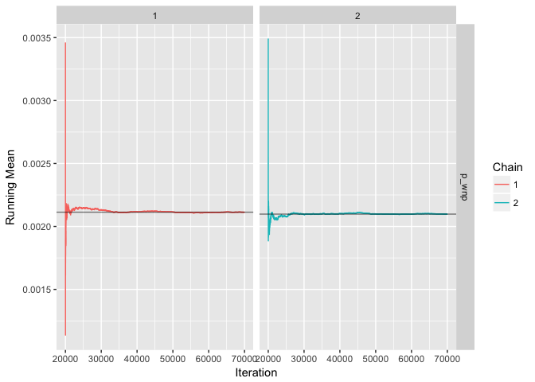
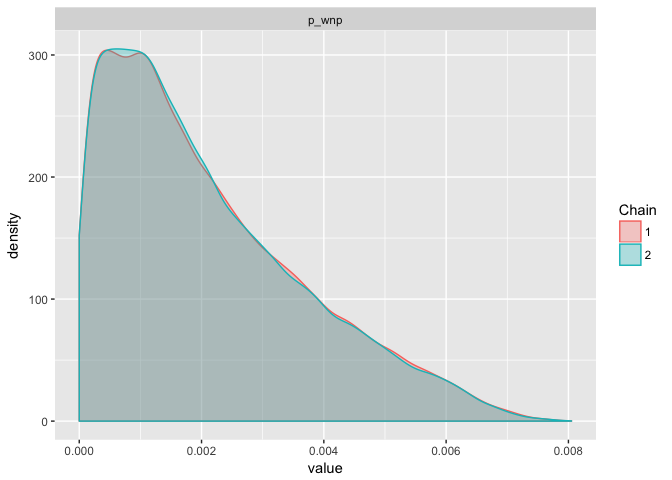

p\_wnp
================

### John R. Brandon, PhD

This notebook replicates the results of Model 2B, the preferred model, of Moore and Weller (2013). The effort has served a couple of purposes: (1) an independent verification; and, (2) a code source that can be used to analyze simulation output for risk assessment.

Moore and Weller (2013) developed the original code for Model 2B in WinBUGS. I developed JAGS code (Plummer 2013; "Just Another Gibbs Sampler"), using the `rjags` package in this exercise. The code is open source below, and JAGS is cross platform friendly.

Model 2B: Comparing results
---------------------------

### Relative abundance parameter calculation

Model 2B has a hierarchical structure (a mixture of probability distributions), with a hyper-prior probability distribution for the upper bound (*P*<sub>*m**a**x*</sub>) of the conditional probability that a whale is a WNP gray, given the proportion of WNP whales associated with the ENP migration and the relative abundance of the two stocks.

This *P*<sub>*m**a**x*</sub> hyper-prior is the product of two components, one fixed and one random. The fixed component is the relative abundance of the two stocks. In Model 2B, the relative abundance is fixed equal to the 99th percentile of the WNP abundance estimate (the WNP upper bound) divided by the 1st percentile of ENP abundance (the ENP lower bound). I ran some sensitivity tests on this assumption for Model 1B back in 2013, and the results were robust. I haven't run sensitivity tests for Model 2B.

Nevertheless, the first thing to to do to replicate Moore and Weller's results is to make sure the relative abundance parameter is calculated properly.

``` r
# Checking here that my calculations of the "rel_abun" parameter are consistent:
#   where:  WNP_99% = 99th percentile of WNP abundance estimate (from 2007)
#           ENP_01% = 1st percentile of ENP abundance estimate  (from 2012)
#           scale = WNP_99% / ENP_01%
# Means and sigmas in log-space for ENP and WNP abundance estimates
# where, for example: N_enp ~ log-normal(mu_enp, sigma_enp)
# Values for mu's and sigma's from: 
#   Moore and Weller (2013): Methods/Data/Abundance Estimates
mu_enp = 9.856    
sigma_enp = 0.0709

mu_wnp = 5.043
sigma_wnp = 0.0387

enp_01 = qlnorm(p = 0.01, meanlog = mu_enp, sdlog = sigma_enp)  # ENP_01stPercentile
wnp_99 = qlnorm(p = 0.99, meanlog = mu_wnp, sdlog = sigma_wnp)  # WNP_99thPercentile

rel_abun = wnp_99 / enp_01
```

The solution from this approach and data is: Maximum relative WNP / ENP abundance = 0.0104827

So, the assumption here is that the upper limit on the percentage of the ENP migration that could potentially be WNP gray whales is about 1%. That's also assuming that all WNP gray whales have an ENP migration route.

### JAGS code for Model 2B

Given a value for the fixed relative abundance component, we can develop the Model 2B JAGS code for the probability that there will be a take of a WNP gray in the proposed Makah hunt (*P*<sub>*W**N**P*</sub>).

The other component of *P*<sub>*m**a**x*</sub> is, the proportion of the WNP stock that has an ENP migration route (*m*). That proportion is uncertain, and treated as a random variable. It is multiplied by the relative abundance parameter to derive *P*<sub>*m**a**x*</sub>.

The JAGS code below provides the methods used to replicate the estimate of *P*<sub>*W**N**P*</sub> for Model 2B.

``` r
# JAGS code and list of input quantities for P_WNP gray whale take | Makah hunt 
# Note, I installed JAGS (v 4.2.0) from:
#   https://sourceforge.net/projects/mcmc-jags/files/
# install.packages("rjags")
# install.packages("runjags")
library(rjags)    # version 4-6
library(runjags)  # version 2.0.4-2

# Data and parameters reported in Moore and Weller (2013) -------------------------
n_mig = 83      # Number of non-PCFG migrants out of N (118) sightings in the MU&A data
n_sights = 118  # Total number of sightings in the MUA sightings data set
m_min = 0.15    # Lower bound of prior for proportion of WNP that migrate through MU&A
m_max = 1.0     # Upper bound of prior for proportion of WNP that migrate through MU&A
# rel_abun = 0.01048267  # rel_abun <- N_WNP(99th percentile) / N_ENP(01st percentile); calcs above

# Create an input list that will be sent to the JAGS compiler to initialize the sampler
gw_dat = list(n_mig = n_mig,
              n_sights = n_sights,
              m_min = m_min,
              m_max = m_max,
              rel_abun = rel_abun)  # rel_abun calculated above

# Model 2B ------------------------------------------------------------------------
m2b_jags = "
  model {

    # Likelihood
    #   where:
    #     n_mig = 83 (non-PCFG migrants in MUA sightings data)
    #     n_sights = 118 (total sightings in MUA, including PCFG)
    n_mig ~ dbin(p_mig, n_sights)

    # Parameters
    m ~ dunif(m_min, m_max)  # Probability a WNP whale migrates through MU&A
    p_max <- m * rel_abun       
    p_wnp_mig ~ dunif(0, p_max)
    
    p_mig ~ dunif(0, 1)  # Moore and Weller (2013): Bayesian estimation section

    # Marginal probability of WNP gray whale being taken in hunt
    p_wnp <- p_mig * p_wnp_mig  

  }
  "
```

### Running Model 2B

``` r
# Write model to file  -- there are other ways to do this, but nice to have a model text file
capture.output(cat(m2b_jags, fill = TRUE), file = "m2B.jags")  

# Send the model to JAGS so it can compile it and determine how to draw samples
m2b = jags.model(file = "m2B.jags",
                    data = gw_dat,
                    n.chains = 2)
```

    ## Compiling model graph
    ##    Resolving undeclared variables
    ##    Allocating nodes
    ## Graph information:
    ##    Observed stochastic nodes: 1
    ##    Unobserved stochastic nodes: 3
    ##    Total graph size: 15
    ## 
    ## Initializing model

``` r
# Burn-in
# Update function discards 20,000 burn-in samples on each chain.
update(object = m2b,
       n.iter = 20000,   # Burn-em
       progress.bar = "none")

# Sample from P_WNP posterior: 2 chains x 50,000 samples per chain
m2b_samples = coda.samples(model = m2b,
                     variable.names = c("p_wnp"),
                     n.iter = 50000,
                     progress.bar = "none")
```

### Checking output

``` r
library(tidyverse)
m2b_samples %>% unlist() %>% 
  quantile(probs = c(0.50, 0.95)) %>% 
  round(digits = 3) 
```

    ##   50%   95% 
    ## 0.002 0.005

From Tables 1--3 of Moore and Weller (2013), these percentiles should be: 50th percentile = 0.002 (95th percentile = 0.005), after rounding to the third digit.

Hence, the results from my model 2B code are consistent at this stage with the results from Moore and Weller (2013).

### Inspect the Markov Chains

I haven't calculated any convergence statistics, but we can take a closer look at a couple of visual diagnostic plots (autocorrelation and running mean) for the chains. Not surprisingly there's nothing pathologic. They look quite well behaved.

``` r
library(ggmcmc)  # Wrapper functions for plotting MCMC chains using `ggplot`
m2b_tbl = ggs(m2b_samples) %>%  # Wrangle the MCMC chains from a list object to a data.frame table
  as.tbl() 

ggs_autocorrelation(m2b_tbl)  # Plot autocorrelation plot
```



``` r
ggs_running(m2b_tbl)  # Plot running mean of chains
```



``` r
ggs_density(m2b_tbl)  # Plot posterior probability density
```



Gray whale model by the SF Zoo
------------------------------

My session info is below the references.


### References

Moore, J.E. and Weller, D.W. 2013. Probability of taking a western North Pacific gray whale during the proposed Makah hunt. U.S. Dep. Commer., NOAA Tech. Memo. NMFS-SWFSC- 506, 13 p.

Plummer, Martyn. 2013. JAGS: Just Another Gibbs Sampler. <http://mcmc-jags.sourceforge.net/>

### Session Info

``` r
sessionInfo()
```

    ## R version 3.3.2 (2016-10-31)
    ## Platform: x86_64-apple-darwin13.4.0 (64-bit)
    ## Running under: OS X El Capitan 10.11.6
    ## 
    ## locale:
    ## [1] en_US.UTF-8/en_US.UTF-8/en_US.UTF-8/C/en_US.UTF-8/en_US.UTF-8
    ## 
    ## attached base packages:
    ## [1] stats     graphics  grDevices utils     datasets  methods   base     
    ## 
    ## other attached packages:
    ##  [1] ggmcmc_1.1      dplyr_0.5.0     purrr_0.2.2     readr_1.0.0    
    ##  [5] tidyr_0.6.1     tibble_1.2      ggplot2_2.2.1   tidyverse_1.0.0
    ##  [9] runjags_2.0.4-2 rjags_4-6       coda_0.19-1    
    ## 
    ## loaded via a namespace (and not attached):
    ##  [1] Rcpp_0.12.9        GGally_1.3.0       knitr_1.15.1      
    ##  [4] magrittr_1.5       munsell_0.4.3      colorspace_1.3-2  
    ##  [7] lattice_0.20-34    R6_2.2.0           stringr_1.1.0     
    ## [10] plyr_1.8.4         tools_3.3.2        parallel_3.3.2    
    ## [13] grid_3.3.2         gtable_0.2.0       DBI_0.5-1         
    ## [16] htmltools_0.3.5    assertthat_0.1     yaml_2.1.14       
    ## [19] lazyeval_0.2.0     rprojroot_1.2      digest_0.6.11     
    ## [22] reshape2_1.4.2     RColorBrewer_1.1-2 codetools_0.2-15  
    ## [25] evaluate_0.10      rmarkdown_1.3      labeling_0.3      
    ## [28] stringi_1.1.2      scales_0.4.1       backports_1.0.5   
    ## [31] reshape_0.8.6
